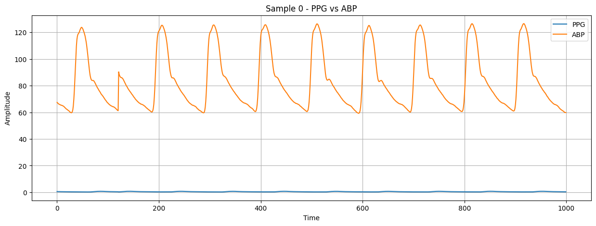
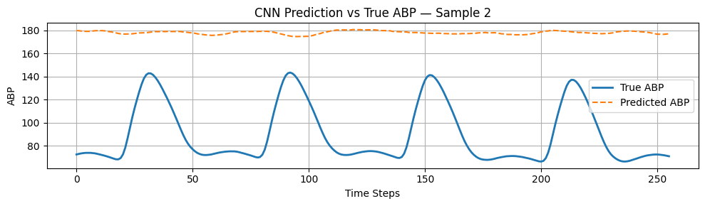
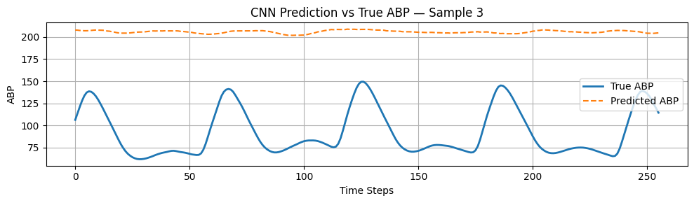

# BLOOD-PRESSRE-DETECTION

# 🩺 Blood Pressure Estimation from PPG Signals

This project uses the [BloodPressureDataset](https://www.kaggle.com/datasets/mkachuee/BloodPressureDataset) to estimate **Systolic (SBP)** and **Diastolic (DBP)** blood pressure values from **PPG signals** using machine learning and deep learning models.

---

## 📁 Dataset

- Source: Kaggle
- Format: `.mat` files containing:
  - Channel 1: PPG (Photoplethysmograph)
  - Channel 2: ABP (Arterial Blood Pressure)
  - Channel 3: ECG (not used)
- Sampling rate: **125 Hz**
- Data is segmented into windows for training

---

## 🧪 Models Used

The following models were trained on PPG signal windows (1000 samples = 8 seconds):

1. **Random Forest Regressor**
2. **Support Vector Regressor (SVR)**
3. **1D Convolutional Neural Network (CNN)**

---

## 🛠 Pipeline Overview

### ✅ Step 1: Preprocessing

- Load `.mat` files and extract records
- Segment signals using sliding window (`1000 samples`, `stride=250`)
- Compute target values:  
  **SBP = max(ABP)**, **DBP = min(ABP)** per window
- Normalize PPG
- Save batched segments as `.npz` files

### ✅ Step 2: Model Training

Each model is trained on:
- Input: `[batch_size, 1000]` PPG segment
- Target: `[SBP, DBP]`

### ✅ Step 3: Evaluation

- Mean Squared Error (MSE) is used to evaluate performance
- Validation results printed per epoch

---

## 📊 Example Results (Approximate)

| Model         | SBP MSE | DBP MSE | Notes                          |
|---------------|---------|---------|--------------------------------|
| Random Forest | ~80–100 | ~40–60  | Fast & robust baseline         |
| SVR           | ~110–150| ~60–80  | Trained on only 2k samples     |
| CNN           | ~70–90  | ~30–50  | Best deep learning performance |

---

## 💻 How to Run (on Google Colab)

### 1. Mount Google Drive and Load Dataset
```python
from google.colab import drive
drive.mount('/content/drive')
```

### 2. Preprocess and Save Batches
```python
from preprocess_bp import process_all
process_all(['/content/Part_1.mat', '/content/Part_2.mat', ...], out_dir='/content/batches')
```

### 3. Train Models
Each model has its own script:
```bash
python train_rf_svr.py     # Random Forest & SVR
python train_cnn.py        # CNN
```

---

## 📦 Requirements

Install dependencies using pip:
```bash
pip install numpy scipy scikit-learn torch matplotlib
```

---

## 📂 Folder Structure

```
BloodPressureProject/
├── data/               <- .mat files
├── batches/            <- Preprocessed .npz files
├── preprocess_bp.py    <- Preprocessing script
├── train_rf_svr.py     <- RF & SVR models
├── train_cnn.py        <- CNN model
├── utils.py            <- Shared helpers
└── Script.ipynb        <- Final notebook version
```

---

## 📈 Visualizations (Sample Output)

The following images are stored in the `OUTPUTS/` folder:

- `OUTPUTS/output.png` - Example PPG window
- `OUTPUTS/out1.png` - Random Forest SAMPLE 1
- `OUTPUTS/output2.png` - SVR Predictions SAMPLE 2
- `OUTPUTS/output3.png` - CNN Predictions SAMPLE 3

### 🔍 Preview







---

## ✅ Status

- [x] Preprocessing Complete
- [x] RF, SVR, CNN Trained
- [x] Results Evaluated


---

## 🏷️ Badges


---

## 🔚 Final Notes

- Extendable to include ECG & multi-signal models
- Ready for deployment on real-time PPG streams (wearables)
- Consider fine-tuning the CNN or using LSTM for sequential modeling
